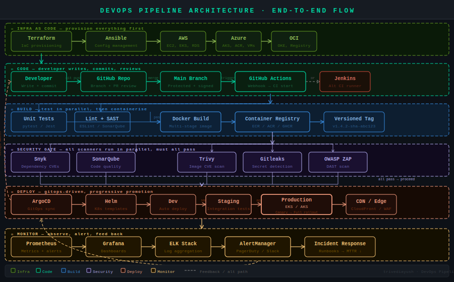

<div align="center">

# 🛠️ AYUSH TRIVEDI | DEVOPS ENGINEER

**Working with Resilient, Scalable, and Automated Cloud Ecosystems**

<br/>

[](https://linkedin.com/in/ayushtrivedi-in)
[](https://trivediayush.github.io/Ayush-Trivedi/)
[](mailto:ayushtrivedi11jan@gmail.com)

<br/>


<br/>

```bash
$ cat profile.json
{
  "name": "Ayush Trivedi",
  "role": "DevOps Engineer",
  "tech_focus": ["Infrastructure as Code", "Kubernetes", "GitOps", "DevSecOps"],
  "mission": "To help teams ship faster through automation and reliable infrastructure."
}
```

</div>

---

## 🛠️ DEVOPS CAPABILITY DASHBOARD

| ☁️ CLOUD | 🏗️ INFRASTRUCTURE | 🔁 PIPELINES |
| :---: | :---: | :---: |
|    |   |    |
|  |  |  |

| 📦 ORCHESTRATION | 🛡️ SECURITY | 📊 MONITORING |
| :---: | :---: | :---: |
|    |    |    |
|  |  |  |

---

## 🔄 DEVOPS PIPELINE ARCHITECTURE

> End-to-end automated pipeline — from a developer's commit to production, with security gates and full observability built in.

<div align="center">
  
</div>

---

## 📈 PROFESSIONAL JOURNEY

```yaml
Current_Role:
  Position: DevOps Engineer
  Org: Aviasole Technologies
  Timeline: Nov 2025 - Present
  Key_Achievements:
    - Helped reduce MTTR through automated incident response workflows.
    - Working with K8s clusters on Azure, focused on uptime and reliability.
    - Implementing DevSecOps practices across the CI/CD lifecycle.

Previous_Experience:
  - Role: DevOps Engineer
    Org: VKAPS IT Solutions
    Timeline: Jun 2025 - Nov 2025
    Focus: AWS CI/CD Automation, Terraform IaC, Significant Deployment Speedup.
  - Role: DevOps Intern
    Org: PearlThoughts
    Timeline: Apr 2025 - May 2025
    Focus: Cloud Automation & Pipeline Foundations.
```

---

## 🚀 FEATURED PRODUCTION PROJECTS

### 🏗️ [AWS EKS + GitOps Microservices Platform](https://github.com/trivediayush/AWS-EKS-GitOps-Microservices-Platform)
> **Goal**: Build a self-healing, auto-scaling microservices environment.
- **Impact**: Significant reduction in manual operational overhead via GitOps.
- **Stack**: `EKS` `Terraform` `ArgoCD` `Helm` `GitHub Actions` `Prometheus`

### 🛡️ [Shift-Left Security (DevSecOps) Pipeline](https://github.com/trivediayush/devsecops-ci-pipeline)
> **Goal**: Integrate security at every stage of the CI/CD lifecycle.
- **Impact**: Focus on production security; 100% automated scan coverage.
- **Stack**: `SonarQube` `Snyk` `Trivy` `Gitleaks` `GitHub Actions`

### 🌐 [Azure Enterprise Multi-Environment CI/CD](https://github.com/trivediayush/Azure-DevOps)
> **Goal**: Achieve high environment consistency across Dev, Staging, and Production.
- **Impact**: Minimized configuration drift and enabled seamless deployments.
- **Stack**: `Azure DevOps` `AKS` `Terraform` `Helm`

---

## 📊 SYSTEM METRICS & CONTRIBUTIONS

<div align="center">


<br/>


</div>

---

<div align="center">

**Let's build the future together!**  
[Email](mailto:ayushtrivedi11jan@gmail.com) • [LinkedIn](https://linkedin.com/in/ayushtrivedi-in) • [Portfolio](https://trivediayush.github.io/Ayush-Trivedi/)

</div>
